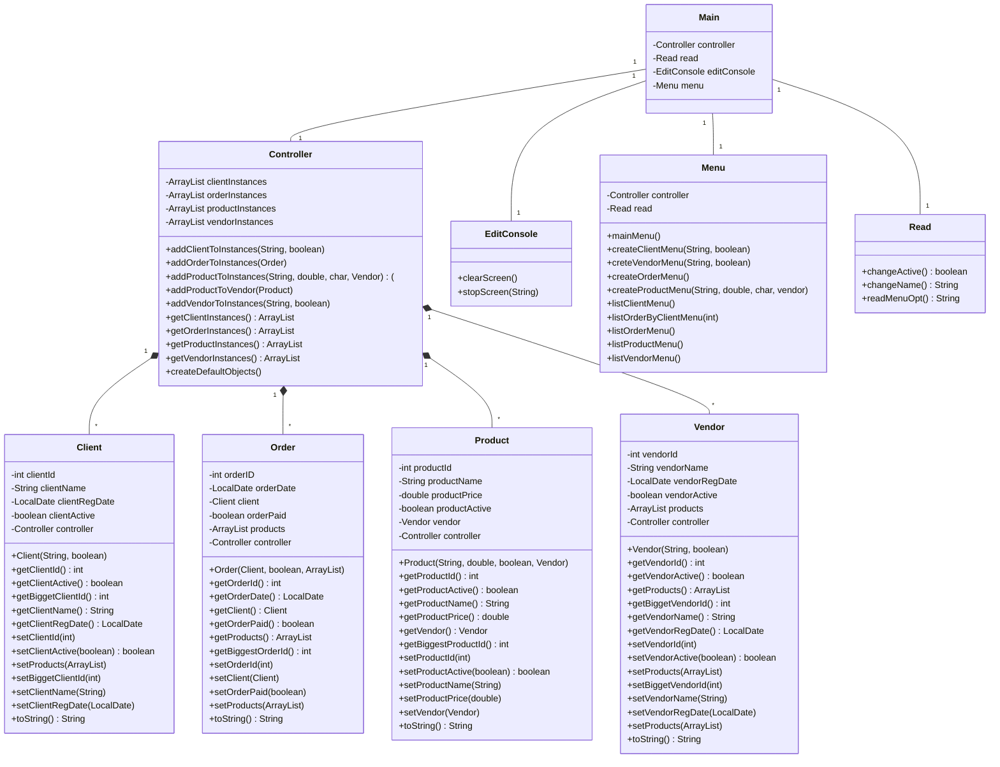

# UF2 Activity 2
This is just a program demanded by my assignment of programming in class.

## License
This repository is licensed under the Creative Commons Attribution-ShareAlike (CC-BY-SA) license. This means that you are free to use, share, and modify the code and any derivative works, as long as you give credit to the original creator and share any derivative works under the same license.

Attribution Requirements
If you use this code in your own work, please provide a clear attribution to the original creator and a link back to this repository.

Share-Alike Requirements
If you create derivative works based on this code, you must share them under the same CC-BY-SA license.

Questions
If you have any questions about this license or would like to discuss using this code in a different way, please contact me at "joel10olor@gmail.com".
## Javadoc

## UML Diagrams
### UML Class Diagram

### UML Usage Cases Diagram

### UML Secuence Diagram