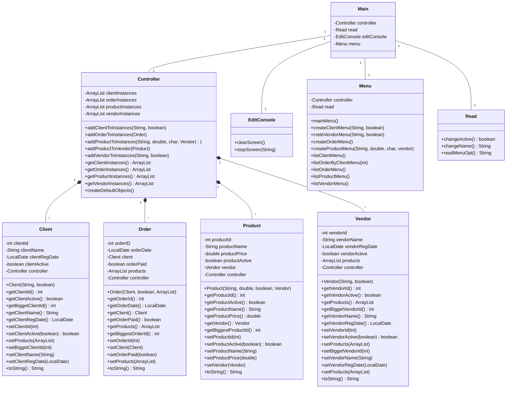

```mermaid
classDiagram
class Client {
        -int clientId
        -String clientName
        -LocalDate clientRegDate
        -boolean clientActive
        -Controller controller

        +Client(String, boolean)

        +getClientId() int
        +getClientActive() boolean
        +getBiggetClientId() int
        +getClientName() String
        +getClientRegDate() LocalDate

        +setClientId(int)
        +setClientActive(boolean) boolean
        +setProducts(ArrayList<Product>)
        +setBiggetClientId(int)
        +setClientName(String)
        +setClientRegDate(LocalDate)

        +toString() String
    }
class Controller {
        -ArrayList clientInstances
        -ArrayList orderInstances
        -ArrayList productInstances
        -ArrayList vendorInstances

        +addClientToInstances(String, boolean)
        +addOrderToInstances(Order)
        +addProductToInstances(String, double, char, Vendor)(
        +addProductToVendor(Product)
        +addVendorToInstances(String, boolean)

        +getClientInstances() ArrayList
        +getOrderInstances() ArrayList
        +getProductInstances() ArrayList
        +getVendorInstances() ArrayList

        +createDefaultObjects()
    }
class EditConsole {
    +clearScreen()
    +stopScreen(String)
}
class Menu {
        -Controller controller
        -Read read

        +mainMenu()

        +createClientMenu(String, boolean)
        +creteVendorMenu(String, boolean)
        +createOrderMenu()
        +createProductMenu(String, double, char, vendor)

        +listClientMenu()
        +listOrderByClientMenu(int)
        +listOrderMenu()
        +listProductMenu()
        +listVendorMenu()
    }
class Order {
    -int orderID
    -LocalDate orderDate   
    -Client client
    -boolean orderPaid
    -ArrayList<Product> products
    -Controller controller
    
    +Order(Client, boolean, ArrayList<Product>)
    
    
    +getOrderId() int
    +getOrderDate() LocalDate
    +getClient() Client
    +getOrderPaid() boolean
    +getProducts() ArrayList<Product>
    +getBiggestOrderId() int
    
    +setOrderId(int)
    +setClient(Client)
    +setOrderPaid(boolean)
    +setProducts(ArrayList<Product>)
    
    +toString() String
}
class Product {
    -int productId
    -String productName
    -double productPrice
    -boolean productActive
    -Vendor vendor
    -Controller controller
    
    +Product(String, double, boolean, Vendor)
    
    +getProductId() int
    +getProductActive() boolean
    +getProductName() String
    +getProductPrice() double
    +getVendor() Vendor
    +getBiggestProductId() int
    
    +setProductId(int)
    +setProductActive(boolean) boolean
    +setProductName(String)
    +setProductPrice(double)
    +setVendor(Vendor)
    
    +toString() String
}
class Read {
    +changeActive() boolean
    +changeName() String
    +readMenuOpt() String
}
class Vendor {
        -int vendorId
        -String vendorName
        -LocalDate vendorRegDate
        -boolean vendorActive
        -ArrayList<Product> products
        -Controller controller

        +Vendor(String, boolean)

        +getVendorId() int
        +getVendorActive() boolean
        +getProducts() ArrayList<Product>
        +getBiggetVendorId() int
        +getVendorName() String
        +getVendorRegDate() LocalDate

        +setVendorId(int)
        +setVendorActive(boolean) boolean
        +setProducts(ArrayList<Product>)
        +setBiggetVendorId(int)
        +setVendorName(String)
        +setVendorRegDate(LocalDate)
        +setProducts(ArrayList<Product>)

        +toString() String
    }
class Main {
    -Controller controller
    -Read read
    -EditConsole editConsole
    -Menu menu
}

Main "1" -- "1" Controller
Main "1" -- "1" Read
Main "1" -- "1" EditConsole
Main "1" -- "1" Menu

Controller "1" *-- "*" Client
Controller "1" *-- "*" Order
Controller "1" *-- "*" Product
Controller "1" *-- "*" Vendor
```